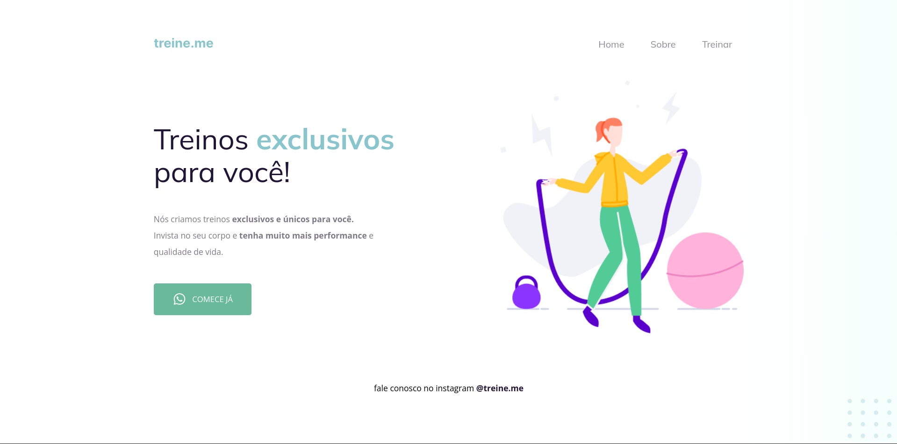

<h1 align="center"> Projeto 02 </h1>

Projeto desenvolvido em conjunto durante os estudos da trilha Explorer da Rocketseat.

  

#### Esse projeto foi desenvolvido com as seguintes tecnologias:

- HTML e CSS
- Git e Github
- Figma

#### Você pode visualizar o layout do projeto através [DESSE LINK](https://www.figma.com/file/rkDOHGPwwFtBNqEdHSuQPd/Projeto-02---Explorer?type=design&node-id=23-1928&mode=design&t=Jv0LE9NaxBgwb8hM-0).
